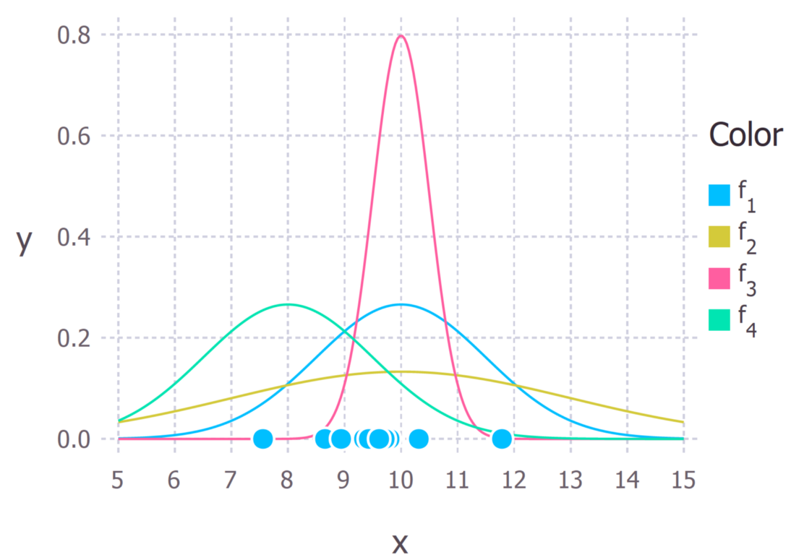

# OPTA-like Model for Predicting Football Championship Outcomes  (AI Translation)
Using the Maximum Likelihood Estimation method and Monte Carlo simulations, we model the final results of European championships.  

<br><br>  

## 📌 Table of Contents  
1. [Description](#description)  
2. [Installation](#installation)  
3. [Models](#models)  
4. [Performance](#performance)  
5. [Usage](#usage)  
6. [Authors](#authors)  

<br><br>  

## <a name="description">📖 Description  
A few fundamentals for understanding.  

### Maximum Likelihood Estimation  
  
We have a sample of values from some distribution and want to determine the parameters of that distribution.  
We find the parameter for which the overall probability of obtaining our sample is maximized.  
For example, in the image, the green distribution describes the sample (dots on the lower axis) clearly worse than the red one.  

### Monte Carlo Method  
The model is repeatedly simulated, and based on the obtained data, probabilistic characteristics of the examined process are calculated.  

### Poisson Distribution Used for Modeling Rare Events  
  

### About the Models  
A more detailed explanation is provided below in [Models](#models).  
The overall idea is as follows: We use match results from past seasons to estimate team strengths.  
These strengths are then converted into probabilities of winning individual matches.  
The current championship is then simulated until the end, and using Monte Carlo methods, we derive final probabilities for each team’s placement.  

<br><br>  

## <a name="models">📊 Models  

### The Algorithm Uses Only Match Results  
Each team is assigned a rating. First, assume team strengths are known and we want to simulate a specific match.  
From the ratings of both teams and the home advantage factor, we calculate their respective strengths in this match.  
Then, using these probabilities, we randomly simulate the match outcome.  
How do we calculate a team’s rating? In each iteration, for every match, the model calculates the probability of the game’s result based on **current** team strengths and then computes its "error" by **subtracting** the probability of the **actual** outcome.  
**The lower this probability, the higher the model’s error.** → By minimizing the error, we adjust team strengths so that the probability of observed results is maximized.  
Additionally, the model accounts for older matches having less influence—recent results are weighted more heavily.  

### The Second Algorithm Considers the Scoreline  
For this, the Poisson distribution is used. The logic remains the same: we adjust team strengths so they best match the number of goals scored in each match, using them as parameters for the Poisson distribution.  
Then, instead of simulating just the match result, we simulate the exact score.  
This allows for a more precise ranking of teams with equal points by considering goal difference.  

### The Third Algorithm Focuses on Goal Difference Rather Than Exact Scores  
Here, the model learns that a 0:2 and 6:8 result are equivalent in footballing terms (though, of course, this isn't entirely true).  
Instead of approximating goals scored per match, the model approximates goal differences between teams.  
Poisson distribution is also used for this. The result is then simulated similarly to the second model—by modeling the number of goals scored by each team.  

<br><br>  

## <a name="performance">📊 Performance  
The models are compared to OPTA using Mean Absolute Error (MAE) and "MAE on probable outcomes" (i.e., outcomes with a probability above 1%).  
All metrics and results can be found in the `models_metrics` folder.  

<table>
  <tr>
    <th rowspan="2">Model</th>
    <th colspan="4">MAE</th>
    <th colspan="4">MAE >1%</th>
    <th rowspan="2">Training time</th>
  </tr>
  <tr>
    <th>ITA</th> <th>ESP</th> <th>RUS</th> <th>Total</th>
    <th>ITA</th> <th>ESP</th> <th>RUS</th> <th>Total</th>
  </tr>
  <tr>
    <td>Result model</td> <td><i>0.83%</i></td> <td><i>0.82%</i></td> <td><i>0.89%</i></td> <td><strong>0.84%</strong></td>
    <td><i>2.60%</i></td> <td><i>2.09%</i></td> <td><i>2.16%</i></td> <td><strong>2.28%</strong></td> <td>Very fast</td>
  </tr>
  <tr>
    <td>Score</td> <td><i>0.68%</i></td> <td><i>0.71%</i></td> <td><i>1.08%</i></td> <td><strong>0.82%</strong></td>
    <td><i>2.12%</i></td> <td><i>1.79%</i></td> <td><i>2.59%</i></td> <td><strong>2.16%</strong></td> <td>Fast</td>
  </tr>
  <tr>
    <td>Diff_score model</td> <td><i>0.84%</i></td> <td><i>0.73%</i></td> <td><i>1.26%</i></td> <td><strong>0.94%</strong></td>
    <td><i>2.65%</i></td> <td><i>1.85%</i></td> <td><i>3.01%</i></td> <td><strong>2.5%</strong></td> <td>Slow (4-5 min)</td>
  </tr>
</table> 

## <a name="installation">🛠 Installation  
1. Clone the repository  
2. Install dependencies from `requirements.txt`  
You can install them using:  

```bash
pip install -r requirements.txt
```  

<br><br>  

## <a name="usage">💡 Usage  
1. Choose one of the models. They are located in the `models` folder:  
   - `Result` – first model, predicting match outcomes  
   - `Score` – second model, predicting exact scores  
   - `Score_diff` – third model, predicting goal difference  
2. The main way to run the model:  
   - Execute `main.py` (`python main.py` from the model’s folder)  
3. To run a model, select a championship dataset from the `for_data` folder and move **ONLY THIS FILE** into the chosen model’s folder.  
   The only `.xlsx` file in the folder should be the one you’re using.  
4. If using custom data, the following conditions must be met:  
   - No matches where a team scores more than 9.5 goals  
   - Team names must be consistent across different seasons  
   - The data format must match the existing files—match results in pairs  
   - Reliable sources include Wikipedia pages of each league’s seasons (e.g., Serie A 24-25 on the Italian Wikipedia page)  
5. After execution, a file `probabilities.xlsx` will appear in the `results` folder.  
   **It will be overwritten on the next run.**  

---  

## <a name="authors">✍️ Authors (with a touch of humor)  
- Developer: Mikhail Vataman  
- Commentator & Translator: ChatGPT  
- Analyst: Said that the key is in proper result interpretation  
- Advertising: PFC CSKA  
- My favorite footballer: Esmir Bajraktarevic  
- Hotel: Trivago
