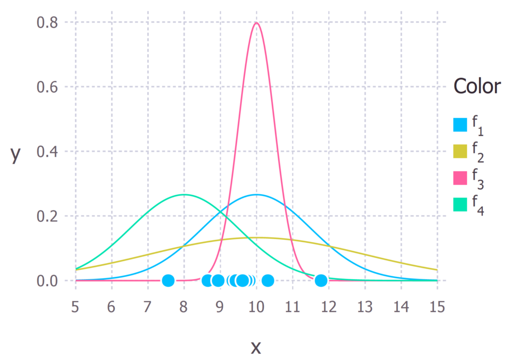
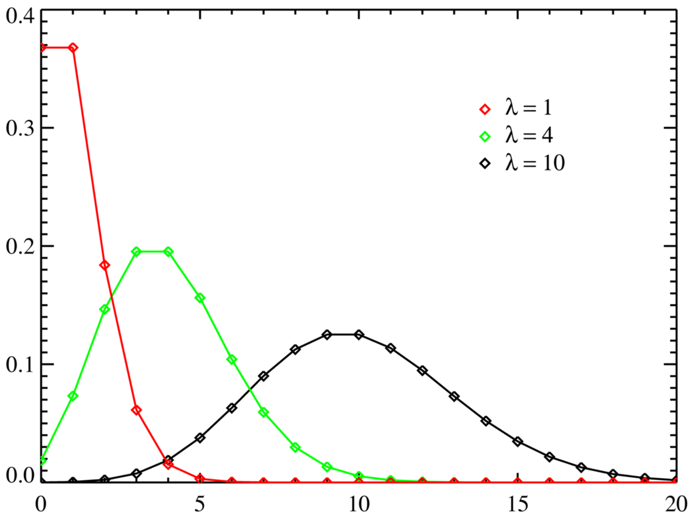

# Аналог модели OPTA для предсказаний вероятности итогов футбольного чемпионата
На основании метода максимального правдоподобия и метода Монте-Карло моделируем итоговые результаты европейских чемпионатов

---

## 📌 Оглавление
1. [Описание](#описание)
2. [Установка](#установка)
3. [Модели](#модели)
4. [Производительность](#Производительность)
5. [Использование](#использование)
6. [Авторы](#авторы)

---

## <a name="описание">📖 Описание
О двух основополагающих понятиях для модели.
   
1 Метод максимального правдоподобия

У нас имеется выборка значений какого-либо распределения и мы хотим найти параметры этого распределения
Тогда мы находим тот параметр, с которым суммарная вероятность получения нашей выборки максимальная.
Например, на картинке зеленое распределение описывает выборку (точки на нижнем оси) явно хуже, чем красное

2 Метод Монте-Карло. Модель многократно обсчитывается, на основе полученных данных вычисляются вероятностные характеристики рассматриваемого процесса.

3 Распределение Пуассона, используемое для моделирования редких событий


4. Есть несколько моделей. Более подробно разберем их в [Модели](#Модели). Глобальный (общий) смысл такой. Мы используем результаты игр в чемпионате за последние несколько сезонов. На основании этих результатов выводятся силы команд, которые затем конвертируются в вероятности победы в каждом отдельном матче. Затем по этим вероятность текущий чемпионат симулируется до конца и методом Монте-Карло получаются итоговые вероятности занять нужное место для нужной команды

## 📊 Модели
1. Алгоритм использует только результаты матчей. Каждой команде сопоставляем значение рейтинга. Сначала допустим, что силы команд уже известны и мы хотим просимулировать определенный матч. Тогда из рейтингов двух команд и фактора домашней команды мы считаем силу обеих команд в этом, отдельновзятом, матче. Затем исходя из этих вероятностей мы случайным образом (выбирая число от 0 до 100) симулируем результат игры. 
Как мы считаем рейтинг команды? На каждой итерации для каждого матча модель на основе **текущих** сил команд считает вероятности результата игры и затем считает свою "ошибку", **вычитая** вероятность **верного** (случившегося) исхода. **Чем меньше эта вероятность, тем больше ошибка модели** -> минимизируя ошибку, мы подбираем такие силы, что вероятность случившихся результатов максимальная. Кроме этого, модель также учитывает, что влияние более давних матчей уменьшается, то есть ошибка модели на этих данных менее критична - модель старается лучше описать последние результаты.

2. Второй алгоритм учитывает счет, с которым играют команды и для этого используется распределение Пуассона. Смысл абсолютно такой же - мы подбираем такие силы команд, чтобы они, являясь параметрами для распределения Пуассона, наилучшим образом соответствовали количеству забитых голов в каждом матче. Затем симулируем уже не результат, а счет игры. Здесь мы даже можем достоверно расположить команды с равным количеством очков, так как уже знаем разницу мячей.

3. Третий алгоритм предполагает, что важен не счет, а разница забитых голов. Модель учится так, что 0:2 и 6:8 - одинаковые с точки зрения футбола исходы (что, конечно, не совсем так). Вместо того, чтобы приближать силами команд голы забитые в матче, модель учится приближать разность голов. То есть теперь у команд такие силы, которые лучше всего описывают попарные разности голов в матчах, а не количество этих голов. Для этого тоже используется распределение Пуассона. А моделируется результат также, как и во втором случае - мы моделируем количество голов, забитых каждой командой.

## 📊 Производительность
Модели сравниваются с OPTA по среднему абсолютному отклонению (усредненный модуль разности с целевыми значениями), т.е. MAE, а также по "MAE на вероятных исходах", то есть на исходах с вероятностью более процента. Эти данные вместе со всеми результатами можно проверить в папке models_metrics.

| Модель       | MAE     | MAE на >1%   | Время обучения     |
|--------------|---------|--------------|--------------------|
| Модель 1     | 92%     | 90%          | Быстро             |
| Модель 2     | 89%     | 85%          | Быстро             |
| Модель 3     | 95%     | 93%          | Медленно (4-5 мин) |

---
## 🛠 Установка
1. Клонируйте репозиторий
2. Установите зависимости из requirements.txt
Вы можете установить их с помощью:
```bash
pip install -r requirements.txt
```

## 💡 Использование
1. Надо выбрать один из вариантов моделей. Они лежат в папке models. Result - первая, предсказывающая результат. Score - вторая, предсказывающая счет. Score_diff - третья, предсказывающая разницу мячей. 
1. После этого есть два варианта запуска: или файл main.py ("python main.py" из папки с моделью), или файл .exe (просто запустить)
2. Для запуска модели нужно выбрать чемпионат (есть три варианта данных в папке for_data) и перенести **ТОЛЬКО ЭТОТ** файл в папку с выбранной моделью.
Рядом с запускаемым файлом должен быть **ЕДИНСТВЕННЫЙ** файл .xlsx
3. При использовании других данных должно выполняться обязательное условие - отсутствие матчей, в которых команда забила более 9.5 голов
Названия команд между страницами разных сезонов, очевидно, должны совпадать. Формат файла именно такой, как в имеющихся файлах - попарные результаты матчей.
Они уверенно ищутся на родных для чемпионатов страницах википедии (например, для Серии А на итальянской странице википедии Серии А 24-25)
4. Затем в папке results появится файл probabilities.xlsx. **При перезапуске он будет перезаписан**

## ✍️ Авторы (с долей юмора)
- Разработчик: Ватаман Михаил
- Комментатор и переводчик: ChatGPT
- Аналитик: сказал, что главное правильно интерпретировать результат
- Реклама: ПФК ЦСКА
- Мой любимый футболист: Эсмир Байрактаревич
- Отель: Триваго 
